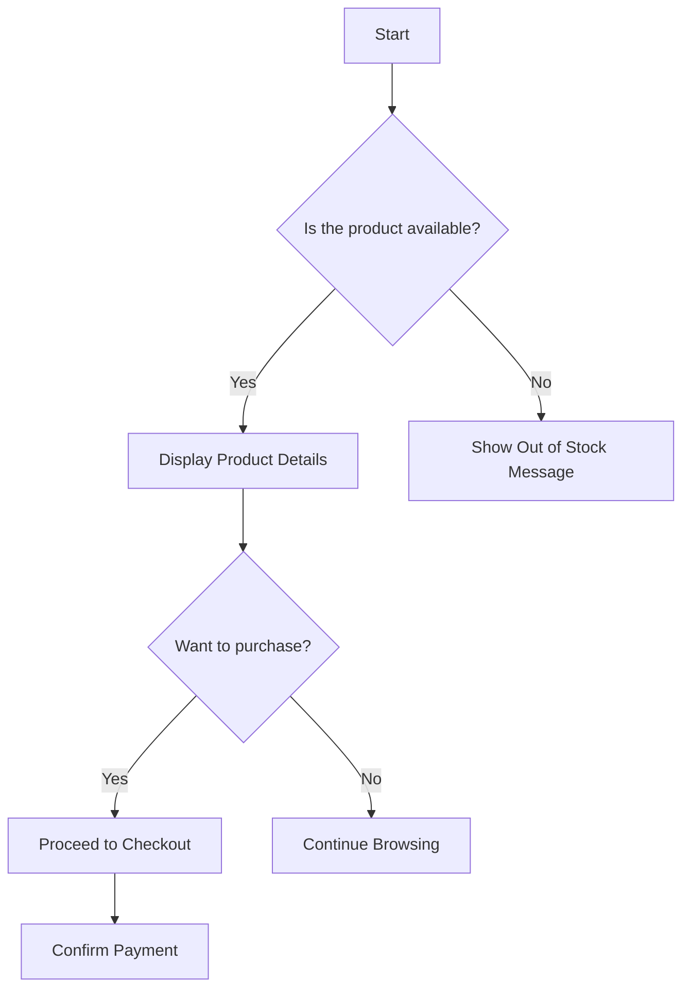

# Product Purchase Flowchart

This diagram illustrates the process a user follows when purchasing a product from an online store. It includes decision points like product availability and the user's intent to buy. The flow ends when the purchase is complete or the user continues browsing.

Start: The user initiates the process by looking for a product.
Is the product available?: This decision checks whether the product is in stock.
If "Yes", the system displays product details.
If "No", the system shows an "Out of Stock" message.
Display Product Details: The user is shown detailed information about the product.
Want to purchase?: The user decides whether they want to buy the product.
If "Yes", they proceed to checkout.
If "No", they continue browsing the site.
Proceed to Checkout: The user confirms their decision to purchase and moves to the payment stage.
Confirm Payment: The user provides payment information to complete the purchase.
Continue Browsing: If the user decides not to purchase, they continue browsing other products.
Out of Stock Message: If the product isn't available, an "Out of Stock" message is displayed.